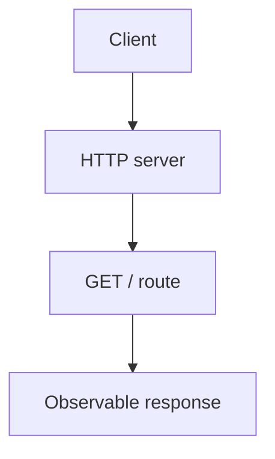

# Fixture architecture

Status: approved. Follow by default.

```mermaid
flowchart TD
    Client --> HTTP["HTTP server"]
    HTTP --> Route["GET / route"]
    Route --> Response["Observable response"]
```

The public HTTP boundary owns request routing. New behavior must remain observable through that boundary.
